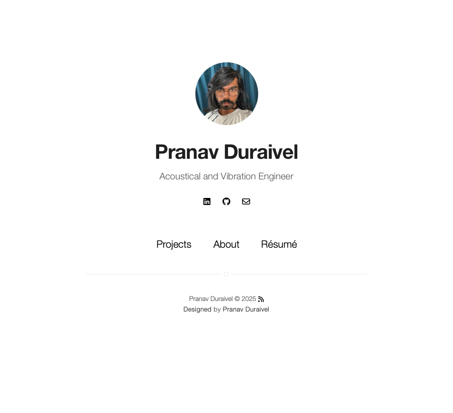

    <h2 align="center">Simple Theme</h2>

This is a simple template for portfolio.

***

    <b><a href="README.md#what-has-inside">What has inside</a></b>
    |
    <b><a href="README.md#setup">Setup</a></b>
    |
    <b><a href="README.md#settings">Settings</a></b>
    |
    <b><a href="README.md#how-to">How to</a></b>

    

